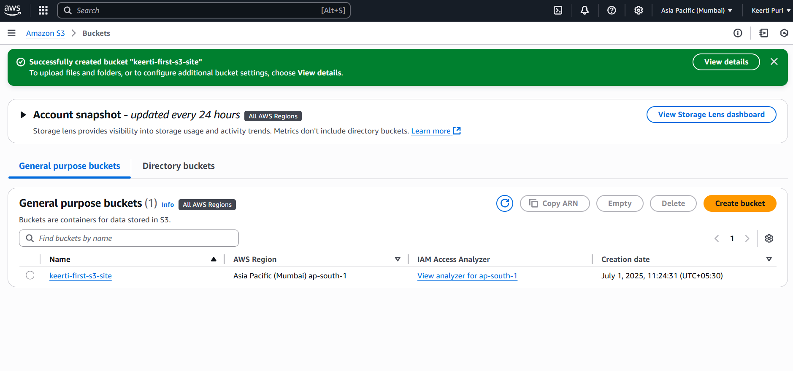
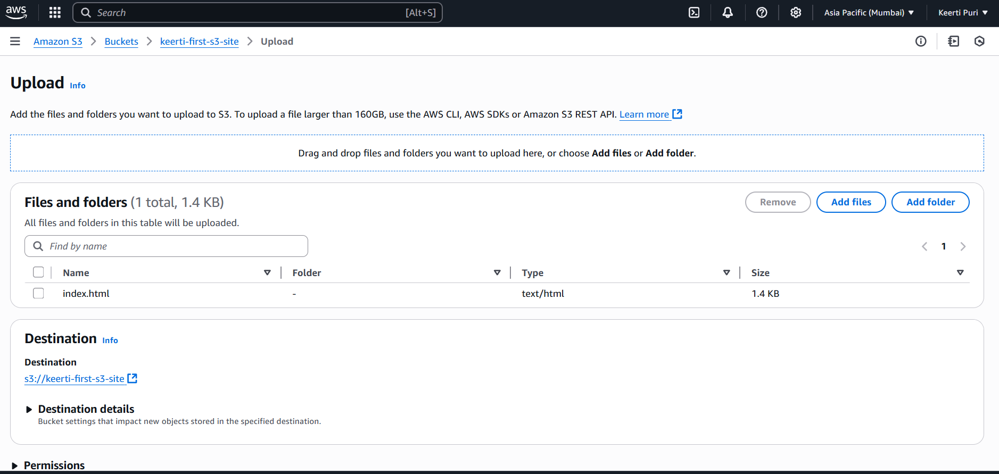
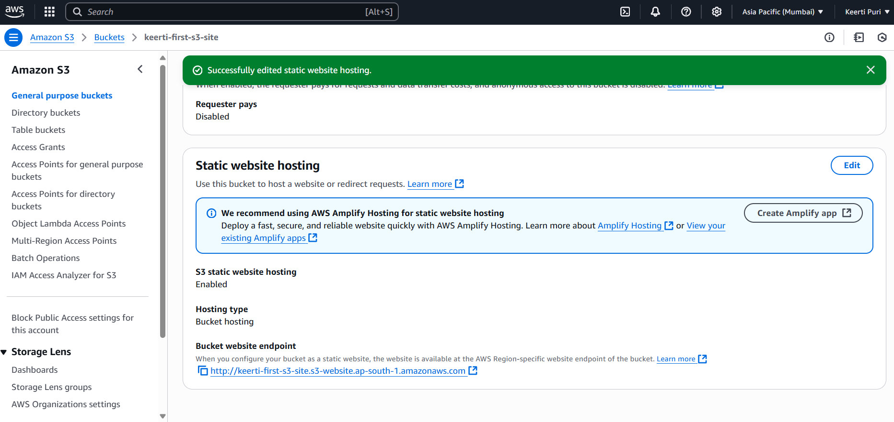
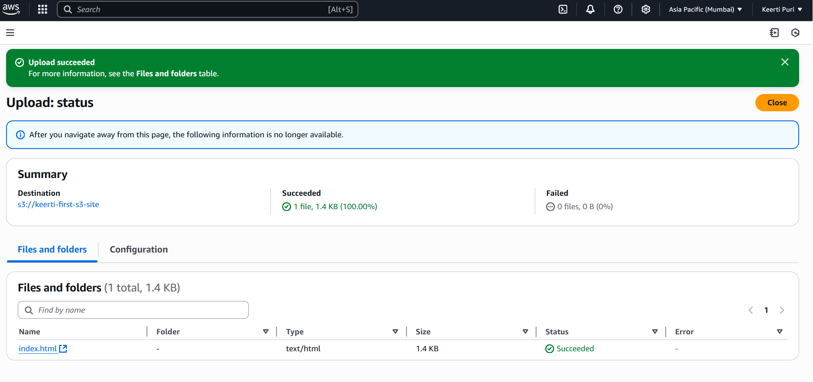
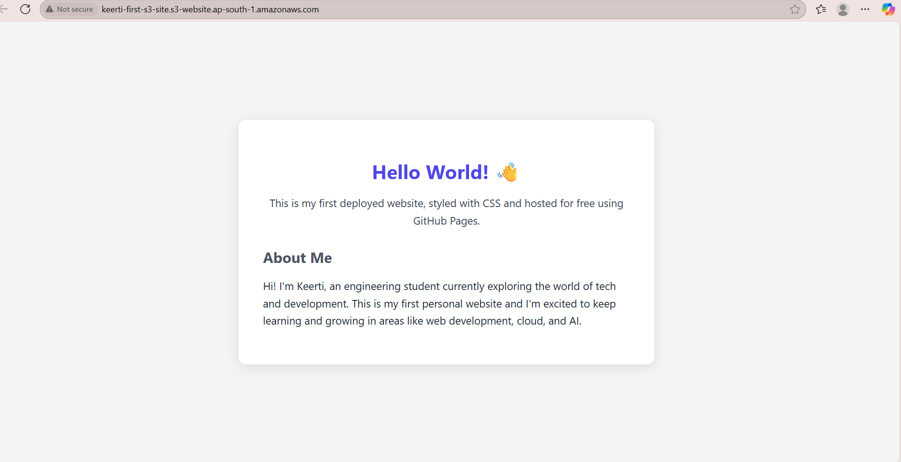

# My First AWS S3 Website 🌐

This project shows how I hosted a static website using **Amazon S3** under the AWS Free Tier.

---

## 🚀 Steps I Followed

### 1. Created an S3 Bucket
- Named the bucket and disabled "Block all public access"  

### 2. Enabled Static Website Hosting
- Configured the hosting properties and got the endpoint URL  

### 3. Uploaded `index.html`
- Uploaded the main HTML file to the bucket  

### 4. Verified Upload Success
- Confirmed the file was successfully uploaded  

### 5. Accessed the Public URL
- Opened the live website using the S3 bucket's endpoint  

### 6. Emptied and Deleted the Bucket
- Cleared and deleted the bucket to avoid future charges

---

## 🧠 What I Learned
- How to host static websites using AWS S3
- Managing bucket permissions for public access
- Why deleting unused AWS resources matters

---

## 🛠️ Tools Used
- HTML
- Amazon Web Services (S3)
- GitHub

---

## ✅ Status
✔️ Successfully deployed and safely removed from AWS Free Tier
